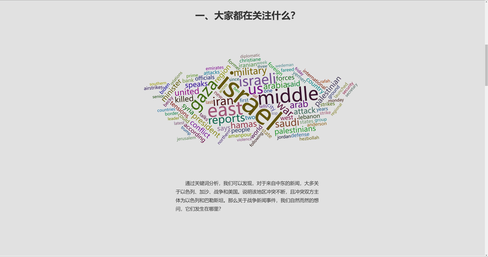
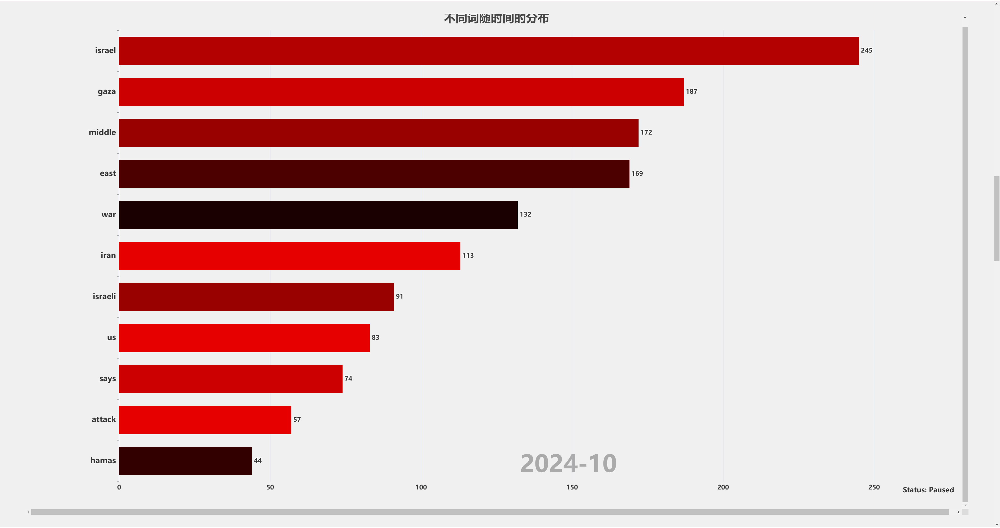
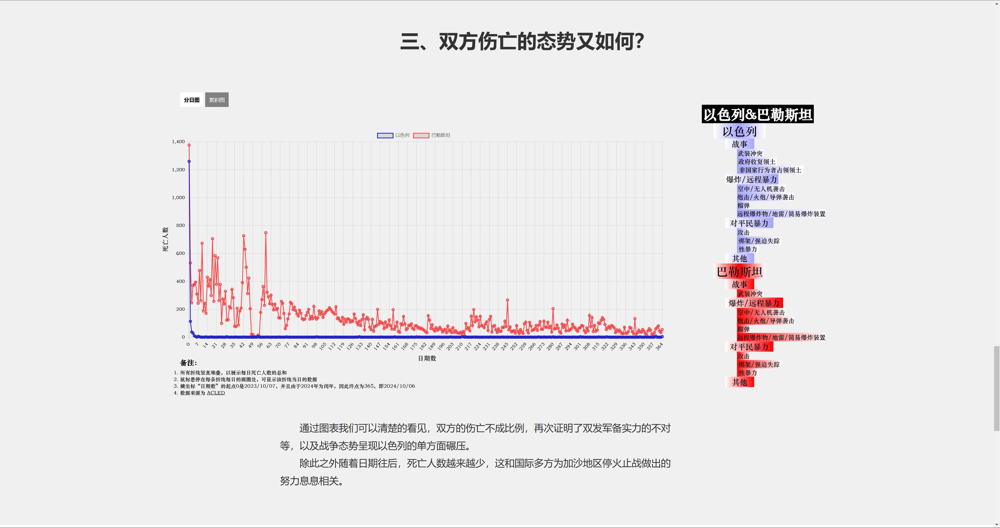

# VIS_Final_MENews （一组中东新闻的分析）
北京大学 2024秋 可视化与可视分析项目，由 卿敬凡、江丰楗、张立儒 共同完成。

Visualization code for Middle East News by Jiang, Qing and Zhang (listed in no particular order) as the final project of VIS course in 2024 Fall at Peking University.

# How to run 
```bash
python -m http.server 8000 
```
之后打开 `chorme` 浏览器，搜索 `http://localhost:8000/index.html` 即可。

# Show






